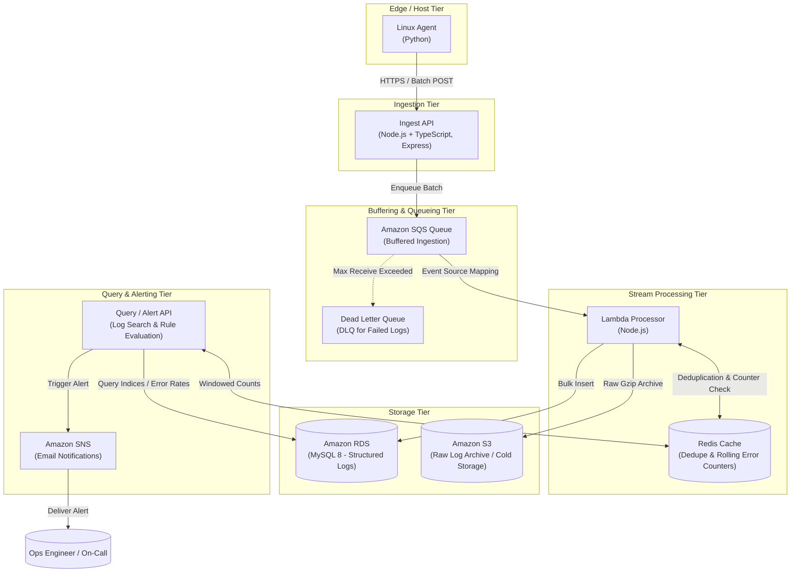

# LogPulse

> **Distributed log ingestion and alerting platform on AWS.**

LogPulse is a high-throughput, fault-tolerant log collection, processing, and alerting system designed for cloud-scale workloads. It provides end-to-end telemetry pipeline capabilities from edge nodes to real-time alerting with cold storage archiving.

---

## Architecture Overview



---

## Monorepo Layout

```
logpulse/
├── /agent          # Linux log harvester agent (Python)
├── /alerts         # Query and alert evaluation engine with SNS dispatch
├── /db             # MySQL 8 schema, migrations, indexing, and seed data
├── /docs           # Architecture specifications, runbooks, and benchmarks
│   └── /benchmarks # Raw benchmark outputs and methodology
├── /infra          # Infrastructure as Code (Terraform)
├── /ingest-api     # High-throughput HTTP ingestion API (Node.js + TypeScript + Express)
├── /loadtest       # Load testing and stress testing harnesses
├── /processor      # Stream log processor (AWS Lambda, Node.js)
└── /scripts        # Operations, deployment, and developer utilities
```

### Component Breakdown

| Directory | Component | Tech Stack | Role |
| :--- | :--- | :--- | :--- |
| [`/agent`](file:///e:/projects/LogPulse/agent) | Edge Log Agent | Python 3 | Tailing system logs, batching, backoff, and forwarding to Ingest API. |
| [`/ingest-api`](file:///e:/projects/LogPulse/ingest-api) | Ingestion Gateway | Node.js, TypeScript, Express | High-concurrency log receiver, schema validation, rate-limiting, enqueues to SQS. |
| [`/processor`](file:///e:/projects/LogPulse/processor) | Stream Processor | Node.js, AWS Lambda | Consumes SQS batches, deduplicates via Redis, writes to MySQL 8, archives raw logs to S3. |
| [`/db`](file:///e:/projects/LogPulse/db) | Database Schema | MySQL 8 (RDS) | Optimized schemas with partitioning, indexes on service/timestamp/level. |
| [`/alerts`](file:///e:/projects/LogPulse/alerts) | Alert Evaluation API | Node.js / TypeScript | Real-time threshold monitoring, rolling window error spikes, SNS email dispatch. |
| [`/infra`](file:///e:/projects/LogPulse/infra) | Infrastructure as Code | Terraform | Provisions VPC, RDS MySQL, SQS + DLQ, Lambda, S3, SNS, and IAM roles. |
| [`/loadtest`](file:///e:/projects/LogPulse/loadtest) | Load Testing | k6 / autocannon / Python | Benchmarking ingestion throughput, latency under load, and recovery verification. |
| [`/docs`](file:///e:/projects/LogPulse/docs) | Documentation | Markdown | Architectural decision records, operational guides, and raw benchmark logs. |
| [`/scripts`](file:///e:/projects/LogPulse/scripts) | Automation Scripts | Bash / PowerShell | Setup, deployment, testing, and maintenance routines. |

---

## Getting Started

### Prerequisites

- Node.js >= 20.x
- Python >= 3.10
- AWS CLI configured with proper IAM permissions
- Terraform >= 1.5.0
- Docker & Docker Compose (for local MySQL and Redis)

### Quick Start (Local Development)

1. **Clone and Setup Environment:**
   ```bash
   git clone https://github.com/AKING55555/logpulse.git
   cd logpulse
   cp .env.example .env
   ```

2. **Configure Services:**
   Refer to each component's individual README in its corresponding folder for detailed setup instructions.

---

## Contributing & Security Guidelines

- **No Secrets in Repo:** Never commit credentials, `.env` files, `.tfstate`, or private keys.
- **Data Integrity:** All benchmark figures documented in `/docs/benchmarks/` must be backed by reproducible raw command outputs.
- **Git Workflow:** Commits follow [Conventional Commits](https://www.conventionalcommits.org/) (`feat:`, `fix:`, `docs:`, `chore:`).

---

## License

This project is licensed under the [MIT License](LICENSE).
