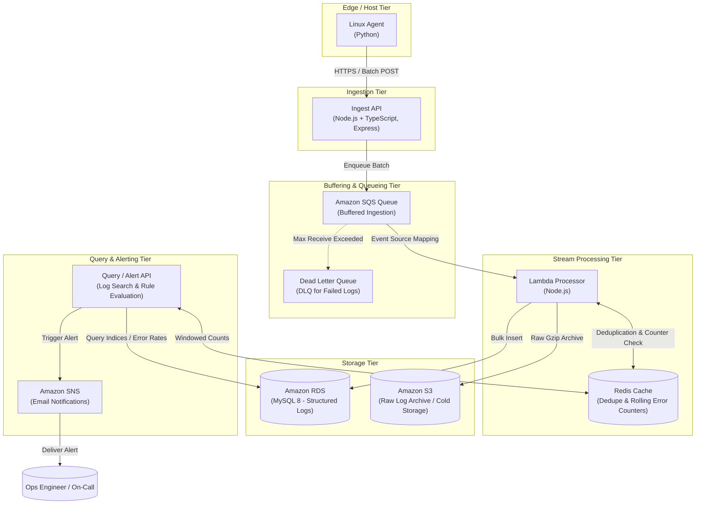

# LogPulse

> **Distributed log ingestion and alerting platform on AWS.**

LogPulse is a high-throughput, fault-tolerant log collection, processing, and alerting system designed for cloud-scale workloads. It provides end-to-end telemetry pipeline capabilities from edge nodes to real-time alerting with cold storage archiving.

---

## Architecture Overview



---

## Monorepo Layout

```
logpulse/
├── /agent          # Linux log harvester agent (Python)
├── /alerts         # Query and alert evaluation engine with SNS dispatch
├── /db             # MySQL 8 schema, migrations, indexing, and seed data
├── /docs           # Architecture specifications, runbooks, and benchmarks
│   └── /benchmarks # Raw benchmark outputs and methodology
├── /infra          # Infrastructure as Code (Terraform)
├── /ingest-api     # High-throughput HTTP ingestion API (Node.js + TypeScript + Express)
├── /loadtest       # Load testing and stress testing harnesses
├── /processor      # Stream log processor (AWS Lambda, Node.js)
└── /scripts        # Operations, deployment, and developer utilities
```

### Component Breakdown

| Directory | Component | Tech Stack | Role |
| :--- | :--- | :--- | :--- |
| [`/agent`](file:///e:/projects/LogPulse/agent) | Edge Log Agent | Python 3 | Tailing system logs, batching, backoff, and forwarding to Ingest API. |
| [`/ingest-api`](file:///e:/projects/LogPulse/ingest-api) | Ingestion Gateway | Node.js, TypeScript, Express | High-concurrency log receiver, schema validation, rate-limiting, enqueues to SQS. |
| [`/processor`](file:///e:/projects/LogPulse/processor) | Stream Processor | Node.js, AWS Lambda | Consumes SQS batches, deduplicates via Redis, writes to MySQL 8, archives raw logs to S3. |
| [`/db`](file:///e:/projects/LogPulse/db) | Database Schema | MySQL 8 (RDS) | Optimized schemas with partitioning, indexes on service/timestamp/level. |
| [`/alerts`](file:///e:/projects/LogPulse/alerts) | Alert Evaluation API | Node.js / TypeScript | Real-time threshold monitoring, rolling window error spikes, SNS email dispatch. |
| [`/infra`](file:///e:/projects/LogPulse/infra) | Infrastructure as Code | Terraform | Provisions VPC, RDS MySQL, SQS + DLQ, Lambda, S3, SNS, and IAM roles. |
| [`/loadtest`](file:///e:/projects/LogPulse/loadtest) | Load Testing | k6 / autocannon / Python | Benchmarking ingestion throughput, latency under load, and recovery verification. |
| [`/docs`](file:///e:/projects/LogPulse/docs) | Documentation | Markdown | Architectural decision records, operational guides, and raw benchmark logs. |
| [`/scripts`](file:///e:/projects/LogPulse/scripts) | Automation Scripts | Bash / PowerShell | Setup, deployment, testing, and maintenance routines. |

---

## Getting Started

### Prerequisites

- Node.js >= 20.x
- Python >= 3.10
- AWS CLI configured with proper IAM permissions
- Terraform >= 1.5.0
- Docker & Docker Compose (for local MySQL and Redis)

### Quick Start (Local Development)

1. **Clone and Setup Environment:**
   ```bash
   git clone https://github.com/AKING55555/logpulse.git
   cd logpulse
   cp .env.example .env
   ```

2. **Configure Services:**
   Refer to each component's individual README in its corresponding folder for detailed setup instructions.

---

## Local Development Environment

LogPulse provides a complete local emulation environment using Docker Compose:

### Services & Port Mappings

To prevent collisions with existing host services, LogPulse maps to isolated host ports:

| Service | Container Name | Host Port | Container Port | Data / Volume |
| :--- | :--- | :--- | :--- | :--- |
| **MySQL 8** | `logpulse-mysql` | `3307` | `3306` | `logpulse-mysql-data` |
| **Redis 7** | `logpulse-redis` | `6380` | `6379` | Ephemeral / In-Memory |
| **LocalStack** | `logpulse-localstack` | `4566` | `4566` | `logpulse-localstack-data` |

*Safety Rule: All containers, volumes, and network names use the `logpulse-` prefix to ensure zero interference with other running workloads.*

### Managing the Environment

Using the `Makefile` or native commands:

```bash
# Start all services and auto-provision LocalStack resources
make up
# Or: docker compose up -d --wait && ./scripts/init-localstack.sh (or scripts/init-localstack.ps1)

# Check service health
make ps
# Or: docker compose ps

# View service logs
make logs

# Stop containers
make down

# Clean reset (destroys data volumes and re-provisions)
make reset
```

### Pre-provisioned LocalStack Resources

- **SQS Main Queue:** `logpulse-events` (Visibility Timeout: 30s, MaxReceiveCount: 3)
- **SQS Dead Letter Queue:** `logpulse-events-dlq`
- **S3 Bucket:** `logpulse-raw`
- **SNS Topic:** `logpulse-alerts`

---

## Database

LogPulse stores structured log events in a **MySQL 8** instance (local Docker on port 3307, production RDS).
All database artefacts live in [`/db`](db/).

### Schema — `logpulse.events`

| Column | Type | Notes |
|:-------|:-----|:------|
| `id` | `BIGINT UNSIGNED AUTO_INCREMENT` | Surrogate key |
| `trace_id` | `CHAR(36) NOT NULL` | UUID v4 from the event source |
| `service` | `VARCHAR(64) NOT NULL` | Originating micro-service name |
| `host` | `VARCHAR(64) NOT NULL` | Emitting host FQDN |
| `level` | `ENUM('DEBUG','INFO','WARN','ERROR')` | Severity |
| `ts` | `DATETIME(3) NOT NULL` | **Millisecond-precision event timestamp** |
| `message` | `TEXT` | Human-readable log message |
| `latency_ms` | `INT` | Request latency in milliseconds |
| `endpoint` | `VARCHAR(128)` | HTTP endpoint path |

**Keys:**
- `PRIMARY KEY (id, ts)` — composite required by MySQL partitioning (every unique/PK key must include the partition column).
- `UNIQUE KEY uq_trace (trace_id, ts)` — deduplication key. `ts` must be set by the **event source** (never `NOW()`); if the same event is retried with a server-generated timestamp it would receive a different `ts` and bypass deduplication.

> **Why is `ts` in every unique key?**  
> MySQL's `PARTITION BY RANGE` requires that every unique/primary key includes the partitioning expression column (`ts` here). This lets MySQL enforce uniqueness locally within a partition without a global cross-partition scan. The consequence is that idempotency of ingestion depends on `ts` being a stable, source-assigned value — **never** defaulted to `NOW()` or `CURRENT_TIMESTAMP`.

### Partitioning

The table is partitioned with `PARTITION BY RANGE (TO_DAYS(ts))`:

- **14 explicit daily partitions** — covering the 7-day historical test window plus the next 7 days.
- **`pmax VALUES LESS THAN MAXVALUE`** — catch-all for any future records.

Partition pruning means time-bounded queries only touch the relevant day-partitions, reducing I/O dramatically on large datasets.

**Adding the next day's partition** (run daily at ~00:05 UTC):

```sql
-- See /db/add_partitions.sql for the full annotated example.
ALTER TABLE events REORGANIZE PARTITION pmax INTO (
    PARTITION p20261012 VALUES LESS THAN (TO_DAYS('2026-10-13')),
    PARTITION pmax VALUES LESS THAN MAXVALUE
);
```

`ADD PARTITION` is not usable when a catch-all `pmax` exists; `REORGANIZE PARTITION` splits it instead. See [`/db/add_partitions.sql`](db/add_partitions.sql) for the full pattern including a stored-procedure example for dynamic scheduling.

### Running the Data Loader

Generates 1,000,000+ synthetic log events with reproducible random seed 42:

```bash
# Prerequisites: pip install pymysql
# Container must be running: make up

python db/generate_data.py          # default: 1,000,000 rows
python db/generate_data.py --rows 500000  # custom row count
```

The loader uses batched multi-row `INSERT` statements (5,000 rows per transaction) and prints rows loaded, elapsed time, and rows/second. It is safety-guarded to only connect to `127.0.0.1:3307`.

**Distribution characteristics:**
- 5 services, 10 hosts, 4 endpoints per service
- ~5% `ERROR`, ~15% `WARN`, ~60% `INFO`, ~20% `DEBUG`
- Latency: lognormal distribution (long-tailed, median ≈ 36 ms)
- Timestamps spread evenly across a 7-day window

### Running the Index Benchmark

```bash
python db/benchmark.py
```

The benchmark:
1. Confirms row count via `SELECT COUNT(*)`.
2. Runs `EXPLAIN ANALYZE` + 3 timed executions for each of the 5 analytics queries (**BEFORE** state — no `idx_service_ts`).
3. Creates `CREATE INDEX idx_service_ts ON events (service, ts)` and runs `ANALYZE TABLE`.
4. Repeats measurements (**AFTER** state).
5. Saves raw `EXPLAIN ANALYZE` output to [`/docs/benchmarks/raw/`](docs/benchmarks/raw/).
6. Writes a summary table to [`/docs/benchmarks/index-benchmark.md`](docs/benchmarks/index-benchmark.md).

### Analytics Queries

See [`/db/analytics.sql`](db/analytics.sql) for:

| Query | Description |
|:------|:------------|
| Q1 | Error rate per 5-minute window per service (last 24 h) |
| Q2 | p95 latency per service using `ROW_NUMBER()` + `CEIL(0.95 * cnt)` |
| Q3 | Top 10 slowest endpoints per service using `DENSE_RANK()` |
| Q4 | Point lookup: service + 2-hour timestamp range |
| Q5 | Filtered ERROR lookup: service + 1-day timestamp range |

All queries filter on both `service` and `ts` so that the `idx_service_ts (service, ts)` index can be used after partition pruning.

---

## Contributing & Security Guidelines

- **No Secrets in Repo:** Never commit credentials, `.env` files, `.tfstate`, or private keys.
- **Data Integrity:** All benchmark figures documented in `/docs/benchmarks/` must be backed by reproducible raw command outputs.
- **Git Workflow:** Commits follow [Conventional Commits](https://www.conventionalcommits.org/) (`feat:`, `fix:`, `docs:`, `chore:`).

---

## License

This project is licensed under the [MIT License](LICENSE).
